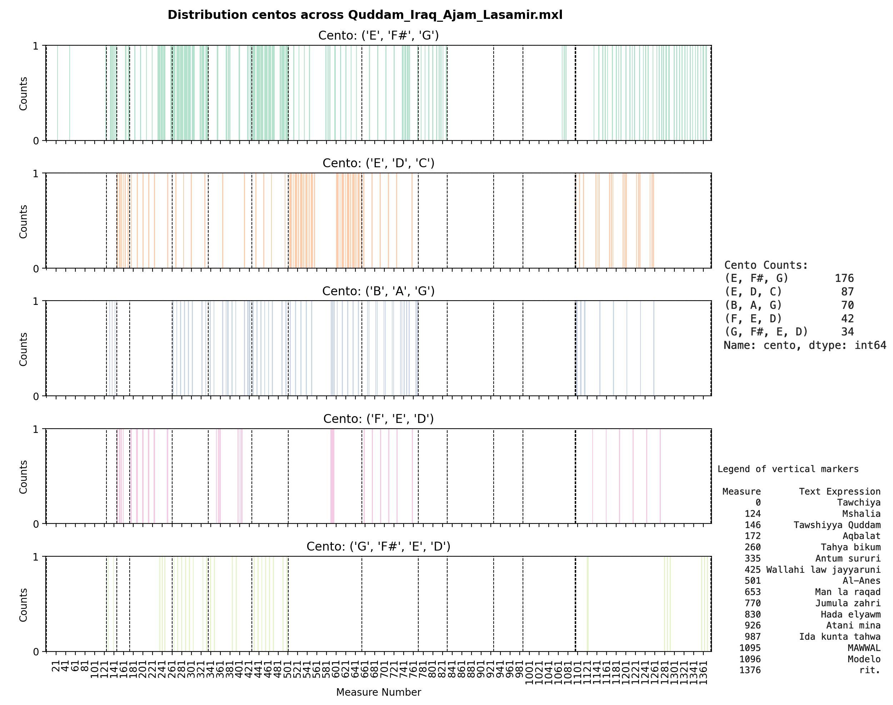

# Towards a systematic exploration of motif development in Arab-Andalusian Music

Authors: Oriol Colomé i Font & Satyajeet Prabhu  
Affiliation: SMC 2023-24. Universitat Pompeu Fabra.  

## Overview
This repository contains the original code and analysis for exploring motif development in ṭab' Iraq-al-ayam, as described in our research paper. The analysis focuses on identifying and tracking musical motifs across different pieces in the Arab-Andalusian tradition.

## Project Structure
- `scores/`: Contains MusicXML files of the analyzed pieces
  - Includes various forms: Btayhi, Quddam, and Bassit in Iraq-Ajam
  - Color-annotated scores showing identified motifs
- `plots/`: Generated visualizations of motif analysis
- `paper/`: Research paper and related materials
- `notebook.ipynb`: Main analysis notebook

## Setup Instructions

### Basic Setup
1. Clone this repository:
```bash
git clone https://github.com/yourusername/arab-andal-motif-dev.git
cd arab-andal-motif-dev
```

2. Create and activate a virtual environment (recommended):
```bash
# Using venv (Python 3.8 or higher recommended)
python -m venv venv
source venv/bin/activate  # On Windows: venv\Scripts\activate
```

3. Install all dependencies:
```bash
# Install all required packages
pip install -r requirements.txt
```

### Development Setup
For development work, additional tools are automatically configured for code quality:

1. Install pre-commit hooks:
```bash
pre-commit install
```

2. The following quality checks will run automatically on commit:
   - Code formatting (black)
   - Import sorting (isort)
   - Linting (flake8)
   - Type checking (mypy)
   - Basic file checks (trailing whitespace, YAML validity)

3. Run quality checks manually:
```bash
# Run all pre-commit hooks
pre-commit run --all-files

# Run tests with coverage
pytest tests/ --cov=src/ --cov-report=term-missing

# Format code
black src tests examples
```

### Configuration Files
- `requirements.txt`: Python package dependencies
- `setup.cfg`: Configuration for pytest, flake8, mypy, and other tools
- `.pre-commit-config.yaml`: Pre-commit hooks configuration
- `.github/workflows/tests.yml`: CI pipeline configuration

### IDE Integration
For the best development experience:
1. Configure your IDE to use the project's virtual environment
2. Enable format-on-save with black (line length: 88)
3. Enable import sorting with isort
4. Enable flake8 linting
5. Enable mypy type checking

## Usage
1. Open `notebook.ipynb` in Jupyter Notebook or JupyterLab
2. The notebook is structured to analyze MusicXML scores from the `scores` folder
3. Generated plots will be saved to the `plots` folder
4. Color-annotated scores can be viewed using Musescore or similar music score editors

## Methodology
The analysis pipeline includes:
- Score parsing using music21
- Motif identification through pattern matching
- Visualization of motif development
- Color annotation of identified patterns

## Results
The plots and annotated scores demonstrate the systematic development of motifs across different pieces in the ṭab' Iraq-al-ayam tradition. Refer to the research paper for detailed interpretation of results.

### Example Visualization
Below is an example of motif analysis in Quddam Iraq-Ajam Lasamir:



This visualization shows the identified motifs and their development throughout the piece.

## Contact
For questions or collaborations, please contact:
- Oriol Colomé i Font: oriol.colome01@estudiant.upf.edu
- Satyajeet Prabhu: satyajeet.prabhu01@estudiant.upf.edu

## License
This project is licensed under the terms included in the LICENSE file.


